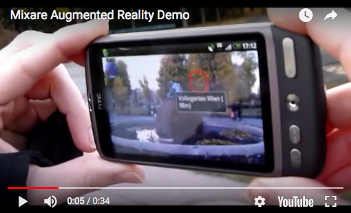

# Mixare4Browser
Modern browser APIs allow to transfer the concept of [MixARE](http://www.mixare.org) (Mixed Augmented Reality Engine) for Web Browser. [Mixare4Browser](https://niebert.github,io/Mixare4Browser) will be able to read the JSON file exported from [Mixare4JSON](https://niebert.github,io/Mixare4JSON) and display the database in the known MixARE way in the web brower (e.g. Firefox, Chromium, Safari, ...). Mixare4Web will be able to read from the JSON database source from a web URL (e.g. provided from a homepage of Wikiversity) or read a small JSON complete from the URL parameters and parse the JSON. The library for LinkParameter linkparam.js will support that concept. The augmented scene will be handled in the same way as done by AR.js handling the displaced of a scene in the aframe..

## Read Link Parameters with linkparam.js
Assume you want to display a specific geolocated number of 3D model (e.g. icons, 3D scans or just primitives boxes, spheres, planes, tubes) in an Augemented Reality scene, then these geolocated set of 3D model are stored in JSON file stored on a web server ___https://www.example.com/mymixare.json___. The parameter call of Mixare4Browser will look like this

  https://niebert.github.io/Mixare4Browser/index.html?jsonurl=https%3A%2F%2Fwww.example.com%2Fmymixare.json

The library ___linkparam.js___ will extract the ___jsonurl___  from the link above and the key-value pair will be
  <tt>jsonurl="https://www.example.com/mymixare.json"</tt>. Details about the library can be found at URL:

  https://niebert.github.io/LinkParam

## Augmented Reality Scene with AFrame
The framework [AFrame](https://aframe.io/examples/showcase/sky/) will be used to control the webbased virtual reality scene.

## AR.js control displacement
Control displacment of the 3D models in the camera image of mobile devices is performed by [AR.js](https://github.com/jeromeetienne/AR.js/blob/master/README.md). The framework AR.js recognizes a marker image in the camera live stream. A marker defines a coordinate system in the threedimensional space. Origine of the coordinate system is placed in the center of marker (e.g. the ___Hiro___-marker). Turning and moving the marker moves the 3D object attached to the coordinate system of marker. On the other end we [AFrame](https://aframe.io) has a coordinate system in which the 3D object are moved according to displacement of the marker.

## Browser Check
With the URL https://whatwebcando.today/ you can check your browser on your mobile device if it support the relevant APIs in category "Location and Position" for
* Geolocation,
* Device Orientation,
* Device Motion.
